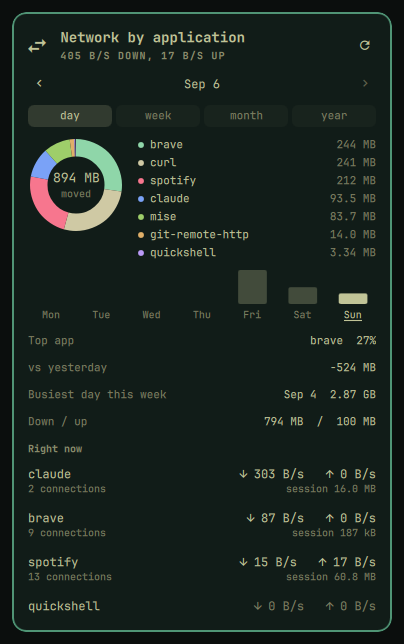

# Siphon

Which application is eating your bandwidth, live in the Omarchy bar.



Every other network widget tells you *how fast* the link is going. Siphon tells
you *who is doing it*. Applications are ranked by what is moving right now, so
the top row answers "why is this crawling" the moment you open the panel.

## What it does

**Right now.** Applications ranked by what is moving this second, with
connection counts and a live rate in the bar. The bar label holds a fixed
width, so the widget does not resize and shunt its neighbours along every time
the rate crosses a digit or a unit.

**A day, a week, a month or a year.** Pick the size at the top of the panel and
everything under it follows: a ring of that period's traffic by application
with a legend, its parts as a bar chart, and the four numbers worth knowing.
The top app and its share, the change against the period before, the busiest
part, and the download against upload split.

The arrows step by one of whatever size is selected, and stop at today because
nothing has happened after it. Clicking a bar is a size down: a bar in the year
opens that month, a bar in a month or a week opens that day, and a bar in the
day view moves the day. Switching size keeps your place, so leaving the year
for the day view lands on this morning rather than on the first of January.

A period longer than a day also carries a grid of insight cards: days with
traffic out of days observed, the peak and quietest days, the longest streak,
the average day, and how much could not be attributed at all.

## Where the history lives

`~/.config/omarchy/siphon/history.json`, written at most once every twenty
seconds and once more on shutdown.

Raw per-day detail is kept for 95 days. When a day falls out of that window its
per-app breakdown is folded into its month and its totals stay at day
resolution, so the calendar charts keep a bar for every day while the file
cannot grow without bound. A day exists in exactly one of the two places, which
is what stops a byte being counted twice at the boundary.

Nothing leaves the machine. The plugin makes no network connections of its own;
it only reads the kernel's account of the ones other programs made.

## What it cannot measure, and says so

The kernel keeps byte counters for TCP sockets. It keeps none for UDP, and
QUIC (HTTP/3) rides on UDP. A browser streaming video over QUIC moves real
bytes that cannot be charged to it.

Siphon does not paper over that. It compares what the interfaces counted
against what it could attribute, and shows the difference in its own row,
naming the applications currently holding UDP sockets:

```
Not attributable
  ↓ 12.4 kB/s   ↑ 1.20 kB/s
  QUIC from spotify, brave, packet headers, and other users.
```

That row also absorbs packet framing, which the interface counts and a socket
does not, and connections owned by other users, which are not this session's
to read. Guessing a number for any of it would be worse than leaving it named
and unmeasured.

Loopback is excluded throughout. A local dev server moving 900 MB between two
processes on one machine is not network traffic, and counting it would put
whatever you are building at the top of the list every time.

## What it needs

Nothing elevated. Per-socket counters come from the kernel's socket
diagnostics, which report a process's own sockets to that process's owner.
Sockets belonging to other users show up without a name and are left out
rather than guessed at.

Three read-only commands per tick, and nothing else:

```bash
ss -tinpH          # TCP sockets, their owners, and their byte counters
ss -unpH           # UDP sockets and their owners, for the unmeasured note
cat /proc/net/dev  # what the interfaces themselves counted
```

## Install

```bash
omarchy plugin add https://github.com/Wian47/omarchy-siphon.git --enable
```

Needs Omarchy 4 (Quattro) and `iproute2`, both standard. It calls `ss` and
reads `/proc/net/dev`, and nothing else. Nothing runs with elevated rights.

Adding a widget to the bar needs a full shell restart rather than a plugin
rescan:

```bash
omarchy restart shell
```

To remove it:

```bash
omarchy plugin remove wian47.siphon
rm -rf ~/.config/omarchy/siphon    # optional: forget the recorded history
```

## Settings

| Setting | Default | What it does |
| --- | --- | --- |
| Text beside the icon | `total` | `none`, `total`, `down`, or `top-app`. Vertical bars stay icon-only. |
| Sample interval | 2s | How often the socket table is re-read. |
| Warn above | off | Notify when one app sustains more than this many Mbps. |

## Keys and clicks

- **Pick a size** at the top of the panel to read a day, a week, a month or a
  year, and **the arrows** to step through them.
- **Click a bar** in the strip to open the part of the period it stands for.
  The panel opens on the period holding today again next time.
- **Middle-click the bar icon**, or press `r` in the panel, to reset the
  session totals.
- **Escape** closes the panel.

## Tests

```bash
node test/model.test.js    # 49 tests, no compositor
node test/history.test.js  # 32 tests for the stored history
node test/wiring.test.js   # cross-file checks: QML parses, bindings resolve
node test/live.js 5        # drives the model against this machine's sockets
bash test/render.sh       # draws the panel offscreen, checks the week strip
bash test/prove-checks.sh # breaks each invariant, expects the suite to notice
```

`model.test.js` covers sampling, attribution and presentation.
`history.test.js` covers what is written to disk, what happens at the retention
boundary, and every insight. `wiring.test.js` covers what only breaks when two
files disagree: QML that stopped parsing, a renamed function the panel still
calls, a setting offered in the manifest that no code reads, and a `Service {}`
declared in the panel, which the bar would build twice.

`render.sh` loads the real `Panel.qml` against stand-in shell types and a
seeded history, with Qt drawing to memory instead of a screen. It poses every
size and checks what the strip claims: the right number of bars, one lit in the
day view and it is the day being read, today marked wherever the panel is, no
part of the calendar that has not happened offered as clickable, the arrow to
the next period closed at today, and a real click opening the part it stands
for. It also leaves the pictures in `.render/`, because a layout is something
to look at rather than something to assert about. It needs the Qt QML tools and
skips without them.

## Licence

MIT
